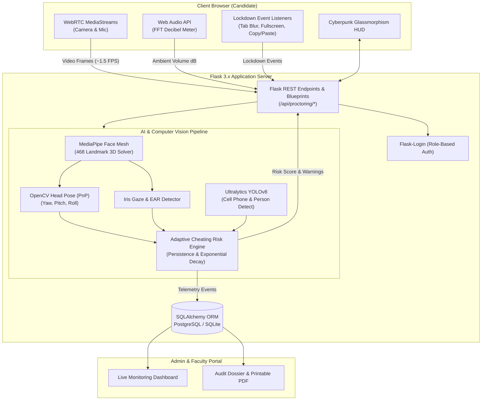

# PROJECT PANOPTICON: AI-POWERED ONLINE EXAM PROCTORING SYSTEM

[](https://www.python.org/)
[](https://flask.palletsprojects.com/)
[](https://opencv.org/)
[](https://developers.google.com/mediapipe)
[](https://ultralytics.com/)
[](https://opensource.org/licenses/MIT)

> **Autonomous, zero-trust remote examination proctoring platform engineered to uphold academic integrity.**  
> Built with Flask, SQLAlchemy, Google MediaPipe, OpenCV, and YOLOv8, Project Panopticon continuously monitors exam environments in real time through a modern glassmorphism interface and an adaptive, multi-factor cheating risk engine.

---

## Table of Contents

- [Overview](#overview)
- [Key Features](#key-features)
- [System Architecture](#system-architecture)
- [Tech Stack](#tech-stack)
  - [Frontend](#frontend)
  - [Backend & AI](#backend--ai)
  - [Database & Storage](#database--storage)
- [AI & Computer Vision Pipeline](#ai--computer-vision-pipeline)
  - [Cheating Risk Engine & Scoring](#cheating-risk-engine--scoring)
- [Project Structure](#project-structure)
- [REST API Reference](#rest-api-reference)
- [Local Development Setup](#local-development-setup)
- [Demo Credentials](#demo-credentials)
- [Automated Testing](#automated-testing)
- [Production Deployment Guide](#production-deployment-guide)
  - [Cloud PaaS (Render / Railway)](#1-cloud-paas-render--railway)
  - [Docker & Docker Compose](#2-docker--docker-compose)
  - [Windows Production (Waitress)](#3-windows-production-waitress)
  - [HTTPS & Camera Permissions](#4-https--camera-permissions-critical)
- [Environment Configuration](#environment-configuration)
- [License](#license)

---

## Overview

Remote assessments are vulnerable to secondary device usage, proxy candidates, off-screen notes, and unauthorized collaboration. **Project Panopticon** eliminates these blind spots using a **hybrid client-server architecture**:

1. **Lightweight Client-Side Telemetry**: The browser captures hardware feeds, runs real-time decibel audio analysis via the Web Audio API, and enforces strict window/fullscreen lockdown.
2. **Server-Side Computer Vision**: Base64 frame samples (~1.5 FPS) are evaluated on the Flask backend through an ensemble of neural networks (MediaPipe Face Mesh + YOLOv8 + Perspective-n-Point 3D head pose solver).
3. **Fairness-First Risk Scoring**: Rather than penalizing harmless natural blinks or momentary glances, an adaptive risk engine evaluates **infraction persistence windows** and applies **gradual risk decay** when compliant posture resumes.
4. **Comprehensive Audit Dossier**: Generates detailed candidate timelines, flagged anomaly snapshots, question responses, and one-click PDF reports for academic review boards.

---

## Key Features

- **Biometric Identity & Single-Candidate Verification**:
  - Pre-flight diagnostic check ensuring camera, microphone, and browser compatibility.
  - MediaPipe 468-point facial mesh verification enforcing single-occupancy before unlocking the exam room.
  - Flags `NO_FACE` (candidate missing) and `MULTIPLE_FACES` (unauthorized helper/proxy).
- **3D Head Pose & Gaze Vectoring**:
  - Solves the Perspective-n-Point (PnP) problem using 3D generic facial models to track **Pitch**, **Yaw**, and **Roll** Euler angles.
  - Eye Aspect Ratio (EAR) and Iris-to-Eye-Corner gaze ratio track suspicious glances (looking left, right, or down at desk) without triggering on blinks.
- **YOLOv8 Threat Detection**:
  - Real-time deep learning inference detecting contraband: **mobile phones** (COCO class 67) and **secondary individuals** (COCO class 0).
- **Acoustic Anomaly Monitoring**:
  - Web Audio API Fast Fourier Transform (FFT) decibel monitor flagging whispering, unauthorized conversations, or audio assistance.
- **Browser Lockdown & Anti-Cheat Events**:
  - Intercepts tab switching (`visibilitychange`), window defocusing (`blur`), fullscreen exit, clipboard actions (`copy`, `cut`, `paste`), and developer shortcuts.
- **Administrative Control Center**:
  - Create and manage exams, configure question banks, view real-time proctoring status, and inspect chronological audit timelines.
  - One-click **Print / Download PDF** for academic misconduct hearings.

---

## System Architecture



---

## Tech Stack

### Frontend
- **Markup & Templating**: HTML5, Jinja2 (server-rendered templates with dynamic blocks).
- **Styling**: Pure Vanilla CSS3 design system (`main.css`, `exam.css`):
  - Cyberpunk dark theme with glassmorphism (`backdrop-filter: blur`, glowing borders).
  - CSS Custom Properties (`--bg-primary`, `--accent-cyan: #00f2fe`, `--accent-violet: #7f00ff`).
  - Scanning video scanlines, live HUD overlays, and print-optimized PDF styling.
- **Typography & Icons**: Google Fonts (`Inter`, `JetBrains Mono`), FontAwesome 6.4.0.
- **Client Web APIs**:
  - `navigator.mediaDevices.getUserMedia`: Accesses local camera and microphone streams.
  - `HTML5 Canvas API`: High-speed frame extraction and Base64 JPEG encoding.
  - `Web Audio API` (`AudioContext`, `AnalyserNode`): In-browser volume/decibel calculation.
  - `Page Visibility & Fullscreen APIs`: Enforces exam window lockdown.
  - `Fetch API`: Asynchronous telemetry dispatch and real-time answer autosaving.

### Backend & AI
- **Language & Runtime**: Python 3.12.
- **Web Framework**: Flask 3.x (Application Factory pattern, modular blueprints).
- **WSGI Production Servers**: Gunicorn (Linux/Containers) or Waitress (Windows).
- **Computer Vision & Neural Networks**:
  - **Google MediaPipe**: 468/478-point facial mesh landmark tracking.
  - **OpenCV (`cv2`)**: PnP 3D pose estimation, frame drawing, matrix operations.
  - **Ultralytics YOLOv8** (`yolov8n.pt`): Real-time mobile phone and secondary person detection.
- **Authentication**: `Flask-Login` session management, password hashing via `werkzeug.security`.

### Database & Storage
- **ORM**: Flask-SQLAlchemy 3.x / SQLAlchemy.
- **Supported Databases**: SQLite (development default) and PostgreSQL (production).
- **Data Models**:
  - `User`: Roles (`student`, `admin`), hashed credentials, profiles.
  - `Exam`: Duration, passing score, questions, status.
  - `Question`: Prompts, multiple-choice options A/B/C/D, correct answer, marks.
  - `ExamAttempt`: Active session state, risk scores, completion timestamps.
  - `Answer`: Candidate responses with autosave timestamps.
  - `ProctoringEvent`: Chronological telemetry log (timestamp, event type, severity, confidence, risk delta).
  - `Warning`: High-risk warnings issued to candidate.
  - `Result`: Final grade, proctoring clearance flag, percentage.

---

## AI & Computer Vision Pipeline

```
  Incoming Frame ──► [ MediaPipe 468 Face Mesh ] ──► Face Count Check
                             │
                             ├──► [ SolvePnP ] ──────────► Head Pose (Yaw / Pitch / Roll)
                             ├──► [ Iris & EAR ] ────────► Gaze Vector (Center / Left / Right)
                             │
                     [ YOLOv8n Detector ] ──────► Mobile Phone (COCO 67) & Person (COCO 0)
                             │
                     [ Web Audio Level ] ───────► Acoustic Anomaly (dB > Threshold)
                             │
                             ▼
              ┌──────────────────────────────┐
              │ Adaptive Cheating Risk Engine│
              │  - Multi-factor weights      │
              │  - Persistence time windows  │
              │  - Exponential risk decay    │
              └──────────────┬───────────────┘
                             ▼
                 Risk Score (0 - 100%) & HUD
```

### Cheating Risk Engine & Scoring

Risk is calculated dynamically per frame and persists in a rolling buffer:

| Anomaly Event | Severity | Default Risk Increment | Persistence Required |
| :--- | :--- | :--- | :--- |
| **Mobile Phone Detected** | `CRITICAL` | **+35%** | Immediate (1 frame) |
| **Multiple Faces Detected** | `CRITICAL` | **+30%** | Immediate (1 frame) |
| **No Face in Frame** | `HIGH` | **+18%** | > 3 consecutive frames |
| **Looking Away (Left/Right/Down)** | `MEDIUM` | **+12%** | > 6 consecutive frames |
| **Acoustic Noise Spike (> 60 dB)** | `MEDIUM` | **+10%** | > 4 consecutive frames |
| **Tab Switch / Window Blur** | `HIGH` | **+20%** | Immediate (1 event) |
| **Fullscreen Exit** | `HIGH` | **+20%** | Immediate (1 event) |

#### Risk Decay
When a student returns to compliant behavior (face centered, normal posture, quiet environment), risk steadily decays using the configured decay factor:
$$\text{Risk}_{t} = \max(0, \text{Risk}_{t-1} \times \text{RISK\_DECAY\_RATE})$$

#### Threat Levels
- `NORMAL` (0% - 20%): Green HUD, compliant posture.
- `LOW_RISK` (21% - 40%): Cyan HUD, minor deviations.
- `WARNING` (41% - 65%): Amber HUD, warning toast dispatched to candidate.
- `HIGH_RISK` (66% - 85%): Orange HUD, formal infraction logged.
- `CRITICAL` (86% - 100%): Red HUD, proctoring dossier flagged for invalidation.

---

## Project Structure

```text
Project-Panopticon/
├── app.py                     # Flask application factory (create_app)
├── config.py                  # Environment configuration classes
├── wsgi.py                    # WSGI server entrypoint
├── requirements.txt           # Python dependency specifications
├── .env.example               # Environment variables template
├── .env                       # Local environment variables (git-ignored)
├── seed_data.py               # Database seeder with sample exams & users
├── yolov8n.pt                 # YOLOv8 nano model weights
├── README.md                  # Comprehensive documentation
│
├── ai/                        # AI & Computer Vision Subsystems
│   ├── __init__.py
│   ├── face_detection.py      # Face presence & count detector
│   ├── face_mesh.py           # 468-point facial landmark mesh
│   ├── eye_tracking.py        # Iris gaze tracking & Eye Aspect Ratio (EAR)
│   ├── head_pose.py           # 3D Perspective-n-Point Euler angle solver
│   ├── person_detection.py    # YOLOv8 secondary person detector
│   ├── mobile_detection.py    # YOLOv8 cell phone detector
│   ├── audio_monitor.py       # Ambient volume & noise spike evaluator
│   ├── cheating_score.py      # Multi-factor risk engine with decay
│   └── proctoring_engine.py   # Master AI coordinator & HUD annotator
│
├── camera/                    # Video Capture & Streaming
│   ├── __init__.py
│   └── camera.py              # Thread-safe OpenCV capture with simulated fallback
│
├── database/                  # Data Access Layer
│   ├── __init__.py            # SQLAlchemy instance
│   └── models.py              # User, Exam, Attempt, Answer, Event models
│
├── routes/                    # Web & REST Endpoints
│   ├── __init__.py
│   ├── auth.py                # Login, registration, role checks
│   ├── student.py             # Student dashboard, system check, exam room
│   ├── admin.py               # Admin control center & audit dossiers
│   └── api.py                 # Real-time frame analysis, answer saving, stats
│
├── templates/                 # Jinja2 Templates (Cyberpunk Glassmorphism)
│   ├── base.html              # Base layout, navbar, toasts, footer
│   ├── landing.html           # Landing page with interactive feature showcase
│   ├── auth/                  # Login & registration templates
│   ├── student/               # System check, biometric verification, exam room
│   ├── admin/                 # Dashboard, exam manager, audit reports
│   └── errors/                # 403, 404, 500 error pages
│
├── static/                    # Frontend Static Assets
│   ├── css/
│   │   ├── main.css           # Global design system & UI components
│   │   └── exam.css           # Live HUD, video feed styling, timers
│   └── js/
│       ├── main.js            # General utilities & toast manager
│       ├── system_check.js    # Pre-flight camera/mic hardware diagnostic
│       └── proctoring_client.js # Real-time exam client & AI loop
│
├── tests/                     # Automated Pytest Suite
│   ├── test_auth.py           # Authentication & authorization tests
│   ├── test_exam.py           # Exam lifecycle & grading tests
│   ├── test_risk_engine.py    # Cheating score engine unit tests
│   ├── test_ai_modules.py     # Face mesh, gaze, and head pose tests
│   └── test_api.py            # Real-time API integration tests
│
├── uploads/                   # Candidate avatar & snapshot storage
└── instance/                  # Local SQLite database files
```

---

## REST API Reference

| Endpoint | Method | Auth | Description |
| :--- | :--- | :--- | :--- |
| `/video_feed` | `GET` | Public | Live MJPEG proctoring stream fallback. |
| `/api/proctoring/system_check` | `POST` | Student | Validates webcam feed and face presence during pre-flight diagnostics. |
| `/api/proctoring/verify_face` | `POST` | Student | Biometric verification ensuring strictly 1 face is centered before starting. |
| `/api/proctoring/analyze_frame` | `POST` | Student | **Core AI Endpoint**: Receives Base64 frame, audio dB, and browser events. Returns HUD metrics, risk score, and warnings. |
| `/api/exam/<attempt_id>/answer` | `POST` | Student | Autosaves selected answer option (`A`, `B`, `C`, `D`) for a question. |
| `/api/exam/<attempt_id>/event` | `POST` | Student | Records client browser violations (tab switch, window blur, fullscreen exit). |
| `/api/exam/<attempt_id>/finish` | `POST` | Student | Submits exam attempt, computes score, and generates final proctoring status. |
| `/api/admin/stats` | `GET` | Admin | Returns aggregate dashboard metrics (total exams, active candidates, flagged sessions). |

---

## Local Development Setup

### 1. Prerequisites
- **Python 3.12** (recommended for binary wheel compatibility with OpenCV, MediaPipe, NumPy, and PyTorch).
- Modern web browser (Chrome, Edge, Firefox, or Safari) with webcam and microphone permissions.
- Git.

### 2. Clone and Setup Environment

```bash
# Clone the repository
git clone https://github.com/<your-username>/Project-Panopticon.git
cd Project-Panopticon

# Create Python virtual environment
python -m venv venv

# Activate virtual environment:
# Windows (PowerShell):
.\venv\Scripts\Activate.ps1
# Windows (Command Prompt):
.\venv\Scripts\activate.bat
# Linux / macOS:
source venv/bin/activate

# Upgrade pip and install dependencies
pip install --upgrade pip
pip install -r requirements.txt
```

### 3. Initialize & Seed Database
Populate the database with sample certification exams, questions, and test accounts:
```bash
python seed_data.py
```

### 4. Run Development Server
```bash
python app.py
```
Open your browser and navigate to: **`http://127.0.0.1:5000`**

---

## Demo Credentials

The database seeder (`seed_data.py`) creates the following pre-configured accounts:

| Role | Email | Password | Access Capabilities |
| :--- | :--- | :--- | :--- |
| **Administrator** | `admin@panopticon.ai` | `Admin@12345` | Exam management, question builder, real-time telemetry, audit reports. |
| **Student (Alex)** | `student@panopticon.ai` | `Student@12345` | Candidate portal, system checks, live proctored exam room. |
| **Student (Sarah)**| `sarah@panopticon.ai` | `Student@12345` | Completed clean exam session (87.5% passing score, Low Risk). |

---

## Automated Testing

Run the automated Pytest suite to verify authentication, grading, AI modules, and API contracts:

```bash
# Run all tests
pytest tests/ -v

# Run with test coverage
pytest --cov=ai --cov=routes tests/
```

---

## Production Deployment Guide

### 1. Cloud PaaS (Render / Railway)

1. **Add Production Dependencies**:
   Append `gunicorn` and `psycopg2-binary` to [`requirements.txt`](file:///c:/Users/pawar/.gemini/antigravity/scratch/Project-Panopticon/requirements.txt):
   ```text
   gunicorn>=21.2.0
   psycopg2-binary>=2.9.9
   ```

2. **Deploy on Render**:
   - Create a **PostgreSQL** database on Render and copy its Database URL.
   - Create a new **Web Service** connected to your GitHub repository.
   - **Build Command**: `pip install -r requirements.txt`
   - **Start Command**: `gunicorn -w 2 -b 0.0.0.0:$PORT wsgi:app`
   - **Environment Variables**:
     - `FLASK_CONFIG` = `production`
     - `SECRET_KEY` = `<generate-a-strong-random-key>`
     - `DATABASE_URL` = `<your-postgresql-url>`
   - Render automatically provisions free SSL/HTTPS, enabling camera access immediately.

---

### 2. Docker & Docker Compose

Deploy on any VPS (AWS EC2, DigitalOcean, Linode, Hetzner) using Docker.

#### Dockerfile
```dockerfile
FROM python:3.12-slim

# Install system dependencies required by OpenCV and MediaPipe
RUN apt-get update && apt-get install -y --no-install-recommends \
    build-essential \
    libgl1 \
    libglib2.0-0 \
    libgomp1 \
    curl \
    && rm -rf /var/lib/apt/lists/*

WORKDIR /app

COPY requirements.txt .
RUN pip install --no-cache-dir -r requirements.txt \
    && pip install --no-cache-dir gunicorn psycopg2-binary

COPY . .

RUN mkdir -p uploads instance

EXPOSE 5000

ENV FLASK_CONFIG=production

CMD ["gunicorn", "--workers=2", "--threads=4", "--bind=0.0.0.0:5000", "--timeout=120", "wsgi:app"]
```

#### docker-compose.yml
```yaml
version: '3.8'

services:
  db:
    image: postgres:16-alpine
    restart: always
    environment:
      POSTGRES_DB: panopticon_db
      POSTGRES_USER: panopticon_user
      POSTGRES_PASSWORD: StrongProductionPassword123!
    volumes:
      - pgdata:/var/lib/postgresql/data
    ports:
      - "5432:5432"

  web:
    build: .
    restart: always
    depends_on:
      - db
    environment:
      - FLASK_CONFIG=production
      - SECRET_KEY=replace-with-a-random-secret-key-at-least-32-chars
      - DATABASE_URL=postgresql://panopticon_user:StrongProductionPassword123!@db:5432/panopticon_db
    ports:
      - "5000:5000"
    volumes:
      - ./uploads:/app/uploads
      - ./instance:/app/instance

volumes:
  pgdata:
```

Launch the cluster:
```bash
docker compose up -d --build
docker compose exec web python seed_data.py
```

---

### 3. Windows Production (Waitress)

To deploy on Windows Server:
```powershell
pip install waitress
waitress-serve --port=5000 wsgi:app
```

---

### 4. HTTPS & Camera Permissions (Critical)

> [!CAUTION]
> **Webcam and Microphone permissions will be blocked by browsers if your site is not served over HTTPS.**

When deploying to a custom domain with Nginx, use Certbot to configure Let's Encrypt SSL:

```bash
sudo apt install -y nginx certbot python3-certbot-nginx
sudo certbot --nginx -d proctor.yourdomain.com
```

Nginx proxy configuration (`/etc/nginx/sites-available/panopticon`):
```nginx
server {
    server_name proctor.yourdomain.com;

    location / {
        proxy_pass http://127.0.0.1:5000;
        proxy_set_header Host $host;
        proxy_set_header X-Real-IP $remote_addr;
        proxy_set_header X-Forwarded-For $proxy_add_x_forwarded_for;
        proxy_set_header X-Forwarded-Proto $scheme;
        
        # Disable buffering for low-latency streaming
        proxy_buffering off;
        proxy_read_timeout 300s;
    }
}
```

---

## Environment Configuration

Configure variables in your [`.env`](file:///c:/Users/pawar/.gemini/antigravity/scratch/Project-Panopticon/.env) file:

| Variable | Default | Description |
| :--- | :--- | :--- |
| `FLASK_APP` | `app.py` | Flask application entrypoint |
| `FLASK_CONFIG` | `development` | Environment mode (`development`, `production`, `testing`) |
| `SECRET_KEY` | *(dev key)* | Session signing key (set a secure 64-char random string in production) |
| `DATABASE_URL` | `sqlite:///panopticon.db` | SQLAlchemy database connection URI |
| `HEAD_POSE_YAW_THRESHOLD` | `28.0` | Max head turn angle (degrees) before flagging lookaway |
| `HEAD_POSE_PITCH_THRESHOLD`| `22.0` | Max pitch angle (degrees) before flagging looking down at desk |
| `EYE_GAZE_EAR_THRESHOLD` | `0.18` | Eye Aspect Ratio threshold (distinguishes lookaway from blinks) |
| `EYE_GAZE_LOOKAWAY_FRAMES` | `6` | Minimum consecutive frames before triggering gaze infraction |
| `MOBILE_DETECTION_CONFIDENCE`| `0.45`| Minimum YOLOv8 confidence score to flag a cell phone |
| `PERSON_DETECTION_CONFIDENCE`| `0.50`| Minimum YOLOv8 confidence score to flag a secondary person |
| `RISK_DECAY_RATE` | `0.92` | Multiplier applied to decay risk when posture is normal |
| `RISK_WARNING_THRESHOLD` | `45` | Score at which warning alerts are sent to candidate |
| `RISK_HIGH_THRESHOLD` | `70` | Score at which candidate is flagged High Risk |
| `RISK_CRITICAL_THRESHOLD` | `88` | Score at which session is marked Critical Violation |

---

## License

This project is licensed under the **MIT License**.  
Developed for high-integrity academic assessment and autonomous examination proctoring.
